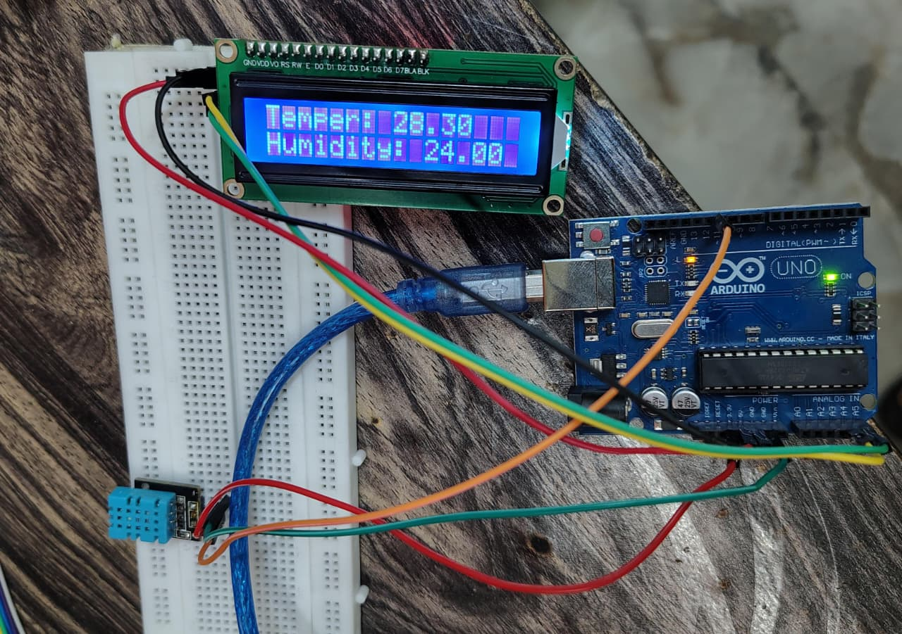
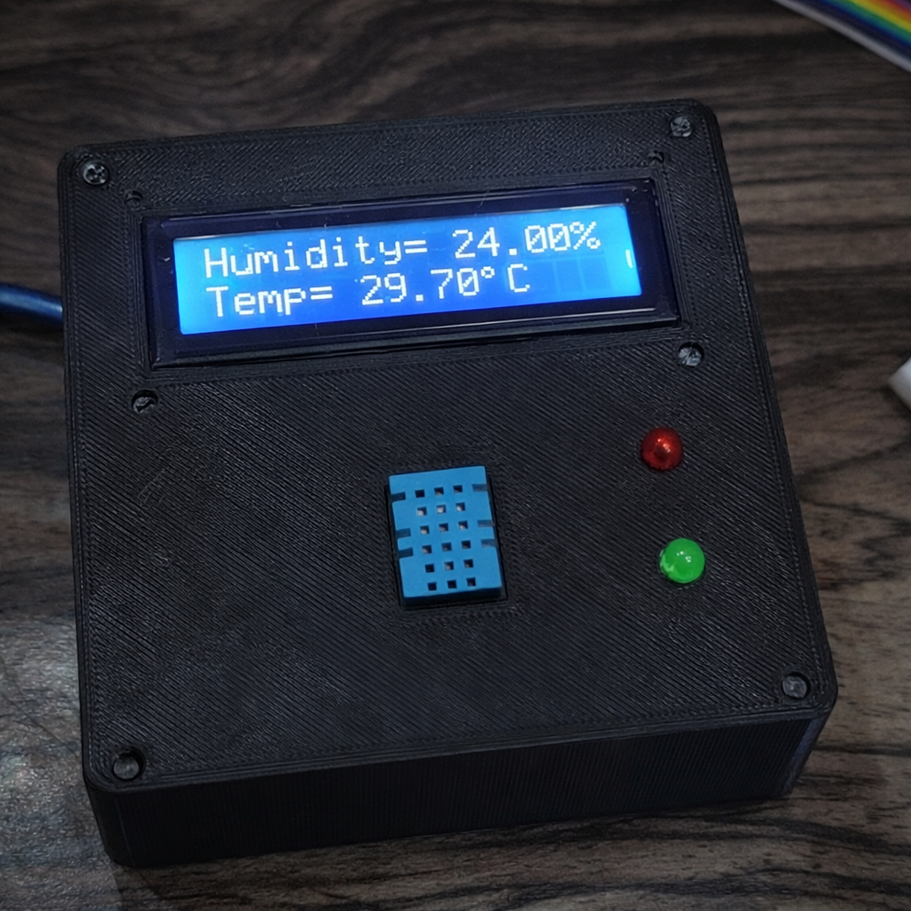

# 🌡 Arduino DHT11 I2C Weather Station

A structured embedded systems project that measures temperature and humidity using a DHT11 sensor and displays real-time data on a 16x2 I2C LCD.

The system is enclosed in a custom-designed 3D printed case for durability and clean hardware integration.

---

## 📸 Final Build

---

## 🧠 Project Overview

This project demonstrates:

- Embedded firmware structuring using function-based architecture
- Sensor data acquisition and validation
- I2C communication with LCD display
- Real-time environmental monitoring
- Custom 3D printed enclosure design
- Hardware-software integration

---

## 🔧 Hardware Components

- Arduino UNO
- DHT11 (3-Pin Module Version)
- 16x2 LCD with I2C Backpack
- 3D Printed Enclosure
- Jumper Wires
- USB Power Supply

---

## 🔌 Pin Configuration

### DHT11 Module (3-Pin Version)

| DHT11 Pin | Arduino UNO |
|------------|------------|
| VCC        | 3.3V |
| DATA       | Digital Pin D2 |
| GND        | GND |

*(Pull-up resistor already integrated in module)*

---

### I2C LCD Display

| LCD Pin | Arduino UNO |
|----------|------------|
| VCC      | 5V |
| GND      | GND |
| SDA      | A4 |
| SCL      | A5 |

I2C Address: `0x27`

---

## ⚙️ Features

- Function-based firmware architecture
- Sensor error handling (`NaN` validation)
- Clean LCD formatting with degree symbol
- Serial debugging output
- Stable power integration
- Physical hardware enclosure

---

## 🧱 Firmware Architecture

The code is structured using modular functions:
